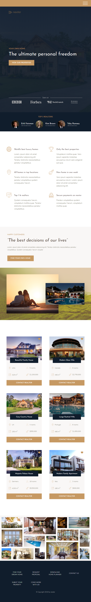

# Nexter
Front-end responsive web design project

## Table of contents
* [General info](#general-info)
* [Technologies](#technologies)
* [Try out](#try-out)
* [Desktop view](#desktop-view)
* [Mobile view](#mobile-view)
* [Sources](#sources)

## General info

Project of landing page of fictional company, who sells luxury apartments. The layout of page is based on CSS Grid.

## Technologies
* HTML
* CSS
* SASS

## Try out
https://mkarasinski.github.io/Nexter/

## Desktop view

  

## Mobile view
  

  

  
## Sources
This app is based on Advanced CSS and SASS Tutorial by Jonas Schmedtmann on Udemy.  
https://www.udemy.com/course/advanced-css-and-sass/
